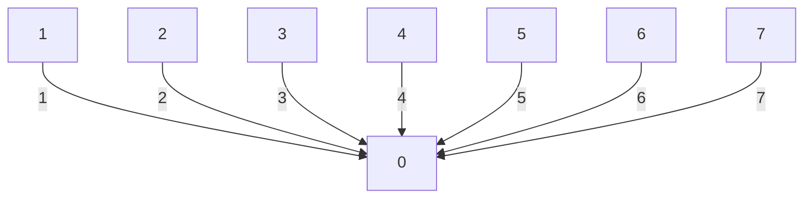
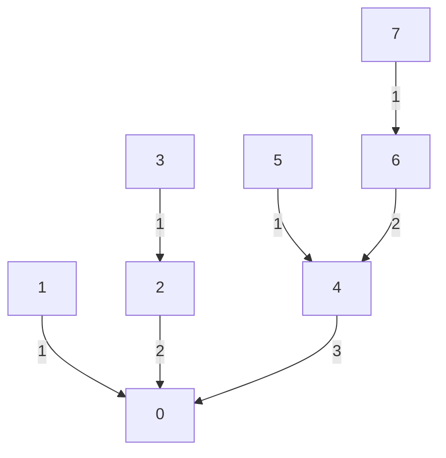

# Homework 3: MPI Programming

Date: 2022-10-06

Name: 陈英发

Student ID: 2022280387

# Introduction

In this assignment, we reimplement `MPI_Reduce` with only `MPI_Send` and `MPI_Recv`, and test the method on a cluster with 4 nodes. We also combine the optimization with parallelization of the summation, which gives further speed improvements.

## Method

A naïve method is to let all processes send the data (synchronously) to process 0 and perform all summation in process 0. However, this requires all process 0 to receive data from all other processes (serially) and perform all the summation. In the meantime, all other processes wait for their turn to send to process 0, and do nothing when they are not sending data.

Assuming 8 processes, the inter-process communication in naïve method is shown below:



> The boxes represent each process, the edges represent data transmission, the label of the edge represent the time step at which the transmission occurs.

Instead, we distribute the computation to maximize the workload on each process. The idea is to divide the processes into groups of two and perform reduction within the groups locally. Then, recursively reduce the results of each groups until the result of all reduction are in passed to process 0. The communication in is shown below:




In this model, for the first step, we divide processes into pairs (0, 1), (2, 3), (4, 5) and (6, 7). They are reduced in the first step, and the result is stored in 0, 2, 4, 6. Then, we recursively divide the results into (0, 2) and (4, 6), and repeat. So the number of communication steps of such reduction is $O(\log(p) )$, where $p$ is the number of processes.

The pseudocode for this reduce function is as follows:

```Pseudocode
Input:
	p: Number of threads
	rank: The rank of this thread

For i = 0, ..., log_2(p)-1:
	if rank is even:
		Receive and sum data from process ((rank + 1) * 2 ^ i)
	else:
		Send data to process ((rank - 1) * 2 ^ i)
		Break loop
	rank = rank / 2
```

## Results

I report the difference between the time of MPI_Reduce $t_{MPI}$ and the time of my implementation $t_{my}$ (i.e. $t_{my} - t_{MPI}$). Each result is the median of multiple runs.

| Array Length | NP=2      | Speedup | NP=4     | Speedup | NP=8   | Speedup |
| ------------ | --------- | ------- | -------- | ------- | ------ | ------- |
| 64K          | -821      | 1.46    | 455      | 0.93    | -3033  | 1.44    |
| 1M           | -64304    | 3.92    | 6273     | 0.87    | 13422  | 0.75    |
| 16M          | -1132248  | 5.44    | -145895  | 1.32    | 150688 | 0.75    |
| 256M         | -17659123 | 5.70    | -3250487 | 1.49    | 955454 | 0.89    |

We see that the speedup (relative to `MPI_Reduce`) is very large for small number of processes, but it decreases as we increase the number of processes. A reason for this might be that `MPI_Reduce` has a significant overhead (likely due to complex implementation) compared to our simple implementation using `MPI_Send` and `MPI_Recv`. When there is a small number of processes, the overhead makes up a significant portion of the runtime, so our method with a smaller overhead is faster. When the number of processes becomes greater, the overhead makes up a smaller portion of the runtime, so `MPI_Reduce` with a faster implementation is faster despite its overhead.

## Multi-threading

We parallelize the summation for-loop using multi-threading with OpenMP. We just need to add the line `#pragma omp parallel for num_threads(...)` in front of the for-loop for summation. 

Same as above, we report the the result is the median of multiple runs

| No. Threads | NP=2      | Speedup | NP=4     | Speedup | NP=8     | Speedup |
| ----------- | --------- | ------- | -------- | ------- | -------- | ------- |
| 1           | -17659123 | 5.70    | -3250487 | 1.49    | 955454   | 0.89    |
| 2           | -10240680 | 4.11    | -3296416 | 1.58    | -767413  | 1.10    |
| 3           | -16016437 | 6.14    | -5894921 | 2.11    | -1972300 | 1.29    |
| 4           | -16522441 | 6.37    | -4601896 | 1.87    | -1270612 | 1.18    |

We know that this multi-threading parallelization only speeds up the summation process. From the result above, we see that the speedup achieve using multi-threading is not as great as multi-processing, which is expected, because inter-process communication is more time-consuming. Additionally, multi-threading gives additional speedup across different number of processes.

## Conclusion

In this assignment, we reimplemented `MPI_Reduce` with only `MPI_Send` and `MPI_Recv`. The results show that our simple implementation has much smaller overhead, allowing it to run faster than the built-in `MPI_Reduce`, but when the number of threads get larger, `MPI_Reduce` achieves better speed, likely because its implementation is more advanced. Additionally, we can combine our method with OpenMP to parallelize the summation process, which speeds up our method even further.