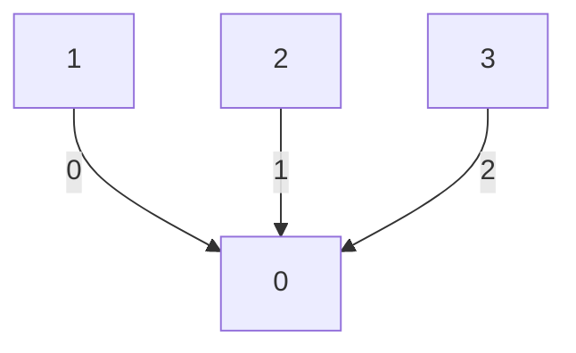
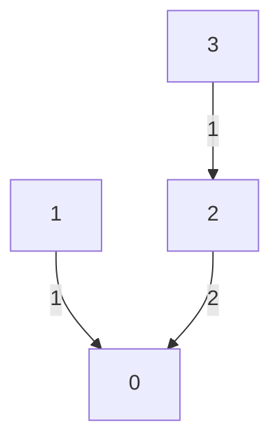

# Manual Implementation of MPI_Reduce

This is a reimplementation of `MPI_Reduce` with only `MPI_Send` and `MPI_Recv`.

## Method

A naïve method is to let all processes send the data (synchronously) to process 0 and perform all summation in process 0. However, this requires all process 0 to receive data from all other processes (serially) and perform all the summation. In the meantime, all other processes wait for their turn to send to process 0, and do nothing when they are not sending data.

With 4 threads, the interprocess communication in naïve method is shown below:



> The boxes represent each process, and the edge represent data transmission, label of the edge represent the time step at which the transmission occurs.

Instead, we distribute the computation to maximize the workload on each process. The idea is to let processes to reduce with their nearest neighbor. The communication in is shown below:




In this model, for process 2 and 3, instead of waiting for the communication between 0 and 1 to complete (and after performing the necessary summation), they perform a local reduction. Because the workload for process 2 and 3 is equal to the workload for process 0 and 1, we can expect that these two reduction finish at approximately the same time. So the communication steps of such reduction is $O(\log(p) )$, where $p$ is the number of processes.

The pseudocode for this reduce function is as follows:

```Pseudocode
Input:
	p: Number of threads
	rank: The rank of this thread

For i = 0, ..., log_2(p)-1:
	if rank is even:
		Receive and sum data from process ((rank + 1) * 2 ^ i)
	else:
		Send data to process ((rank - 1) * 2 ^ i)
		Break loop
	rank = rank / 2
```

## Results

I report the time difference between the MPI_Reduce and my implementation. Each result is the median of multiple runs.

| Array Length \ NP | 2         | Speedup | 4        | Speedup | 8      | Speedup |
| ----------------- | --------- | ------- | -------- | ------- | ------ | ------- |
| 64K               | -821      | 1.46    | 455      | 0.93    | -3033  | 1.44    |
| 1M                | -64304    | 3.92    | 6273     | 0.87    | 13422  | 0.75    |
| 16M               | -1132248  | 5.44    | -145895  | 1.32    | 150688 | 0.75    |
| 256M              | -17659123 | 5.7     | -3250487 | 1.49    | 955454 | 0.89    |

We see that the speedup (relative to `MPI_Reduce`) is very large for small number of processes, but it decreases as we increase the number of processes. A reason for this might be that `MPI_Reduce` has a significant overhead (likely due to complex implementation) compared to our simple implementation using `MPI_Send` and `MPI_Recv`. When there is a small number of processes, the overhead makes up a significant portion of the runtime, so our method with a smaller overhead is faster. When the number of processes becomes greater, the overhead makes up a smaller portion of the runtime, so `MPI_Reduce` with a faster implementation is faster despite its overhead.

## Conclusion